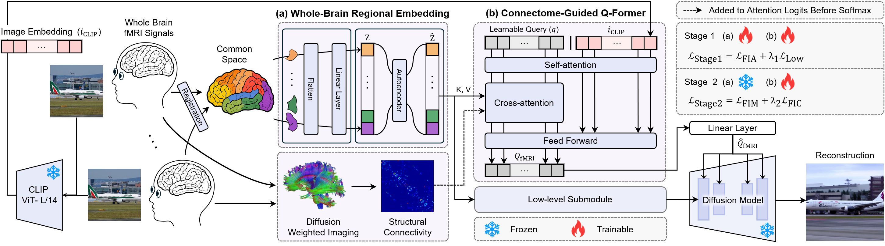
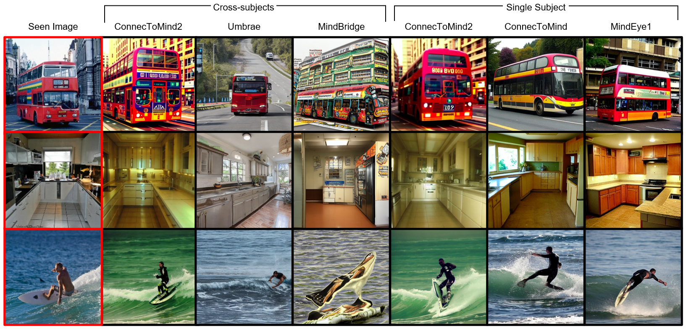

# ConnecToMind2

Official implementation of **ConnecToMind2: Inter-Subject fMRI Decoding via Whole-Brain Connectome-Guided Alignment**.

<p align="center">
  
</p>

ConnecToMind2 is a whole-brain fMRI-to-image reconstruction framework that leverages region-level brain representations and structural connectivity priors for anatomically grounded neural decoding. The model enables both intra-subject and inter-subject image reconstruction without subject-specific adaptation.

## Paper

- MICCAI 2026 (Accepted)
- Paper link will be available upon publication

## Dataset

Experiments are conducted on the [Natural Scenes Dataset (NSD)](https://naturalscenesdataset.org/).

## Installation & Training

```bash
git clone https://github.com/aimed-gist/ConnecToMind2.git
cd ConnecToMind2
bash run.sh
```

## Results

<p align="center">
  
</p>

## Citation

```bibtex
@inproceedings{bae2026connectomind2,
  title={ConnecToMind2: Inter-Subject fMRI Decoding via Whole-Brain Connectome-Guided Alignment},
  author={Bae, Gunwoo and Kim, Yeonwoo and Bae, Junha and Kim, Mansu},
  booktitle={MICCAI},
  year={2026}
}
```
